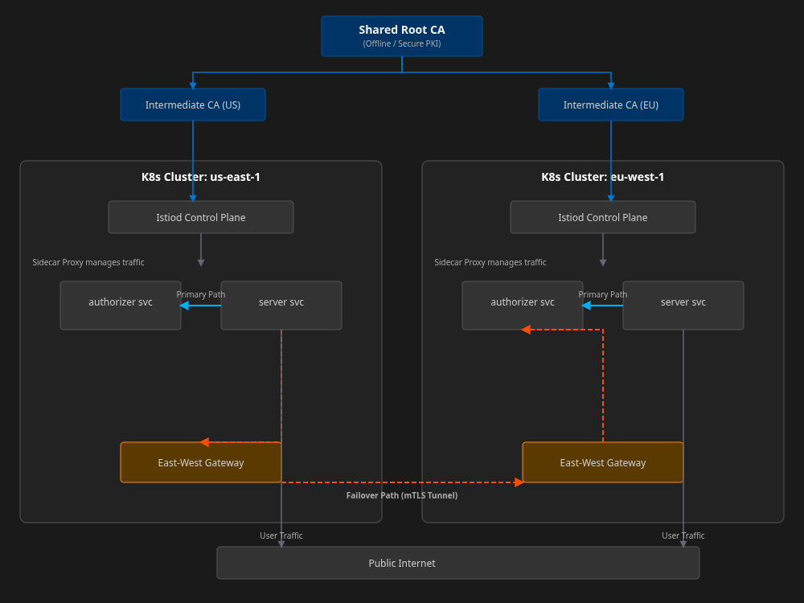

# Streambear: Multi-Cluster Architecture with Istio

## 1. Introduction

This document details the strategy for deploying the Streambear platform across multiple Kubernetes clusters. The primary goals of this architecture are:

*   **High Availability (HA) & Disaster Recovery (DR):** Ensure the service remains operational even if an entire cluster or cloud region becomes unavailable.
*   **Geo-Locality & Low Latency:** Serve traffic to end-users from the nearest geographical cluster to minimize latency. Intelligently route internal service-to-service traffic to remain within the same cluster whenever possible.

## 2. Architectural Model: Multi-Primary with East-West Gateways

We will adopt the **Multi-Primary** Istio deployment model. In this configuration, each cluster runs its own fully independent Istio control plane (Istiod). This model is chosen over the Primary-Remote alternative for its superior fault tolerance; a control plane failure in one cluster does not impact the functionality of any other cluster.

Communication between services in different clusters will be handled securely by dedicated **East-West Gateways**, which are responsible for routing internal, cross-cluster traffic. This approach is more secure and flexible than requiring a flat network where all pods are directly routable across all clusters.

### Conceptual Diagram



## 3. Core Requirement: A Shared Root of Trust

The foundation of cross-cluster security is a shared Public Key Infrastructure (PKI).
1.  **Root CA:** A single Root Certificate Authority will be established. This is the ultimate source of trust for the entire service mesh. It will be used exclusively to sign intermediate certificates.
2.  **Intermediate CAs:** Each cluster's Istiod control plane will be provisioned with its own unique Intermediate CA certificate and key, signed by the shared Root CA.
3.  **Workload Certificates:** Each Istiod will then use its Intermediate CA to sign Certificate Signing Requests (CSRs) from the Envoy sidecars running alongside Streambear services in its own cluster.

This hierarchy ensures that a workload in `us-east-1` can validate the certificate presented by a workload in `eu-west-1` by tracing its signature chain back to the common Root CA, thus enabling secure cross-cluster mTLS.

## 4. Implementation Steps

### Step 1: Certificate Generation & Distribution
1.  Generate the Root CA key and certificate. Store these securely.
2.  For each cluster (`us-east-1`, `eu-west-1`, etc.), generate an Intermediate CA key and a CSR.
3.  Sign each CSR with the Root CA to create the Intermediate CA certificates.
4.  In each Kubernetes cluster, create a secret named `cacerts` in the `istio-system` namespace containing the Intermediate CA's key, certificate, the Root CA's public certificate, and a certificate chain file.

### Step 2: Istio Installation
1.  Install Istio in each cluster using `istioctl` or the Helm chart.
2.  The installation must be configured to use the certificates provisioned in the `cacerts` secret rather than auto-generating a self-signed root.
3.  Install a dedicated **East-West Gateway** in each cluster. This gateway is exposed via a public-facing network Load Balancer and is specifically for handling cross-cluster, intra-mesh traffic.

    ```bash
    # Example istioctl install command snippet
    istioctl install --set values.global.meshID=streambear-mesh \
                     --set values.global.multiCluster.clusterName=<cluster-name> \
                     ...
    ```

### Step 3: Enable Cross-Cluster Service Discovery
1.  For each cluster, create a `kubeconfig` that grants its Istiod control plane read-only access to the other cluster's Kubernetes API server (for services and endpoints).
2.  Add this `kubeconfig` as a secret to the `istio-system` namespace in the respective cluster.
3.  Apply a remote secret in each cluster pointing to the other cluster's secret. This tells Istiod to start watching the remote API server.

Istiod will now automatically discover services running in the peer clusters and push this information to the Envoy sidecars in its local cluster.

## 5. Traffic Management: Locality and Failover

Istio's routing capabilities will be used to manage traffic intelligently.

### 5.1. Locality-Aware Routing
By default, Istio is configured for locality-aware routing. When the `server` role in `us-east-1` makes a call to the `authorizer.default.svc.cluster.local` service, Istio will automatically resolve this to an `authorizer` pod running within the same cluster (`us-east-1`). This is the desired behavior for minimizing latency and cost.

### 5.2. Cross-Cluster Failover
Failover will be configured to automatically redirect traffic to a remote cluster if all local instances of a service become unhealthy.

This is configured using Istio's `DestinationRule` and `VirtualService` resources.

**Example `DestinationRule` for the Authorizer service:**

```yaml
apiVersion: networking.istio.io/v1beta1
kind: DestinationRule
metadata:
  name: authorizer-failover
  namespace: default
spec:
  host: authorizer.default.svc.cluster.local
  trafficPolicy:
    # Configure outlier detection to quickly eject unhealthy pods from the load balancing pool
    outlierDetection:
      consecutive5xxErrors: 3
      interval: 10s
      baseEjectionTime: 30s
    # Define load balancing policy for failover
    loadBalancer:
      simple: ROUND_ROBIN
      localityLbSetting:
        enabled: true
        failover:
          - from: "us-east-1"
            to: "eu-west-1" # If all pods in us-east-1 fail, send traffic to eu-west-1
```

With this configuration, if all `authorizer` pods in the local cluster fail their health checks, Istio's Envoy proxy will automatically and transparently route subsequent requests to the healthy `authorizer` pods in the failover cluster (`eu-west-1`) via the secure mTLS tunnel between the East-West Gateways.

## 6. Deployment Overlays

The existing `deployments/overlays/` structure will be extended for each cluster.

*   `deployments/overlays/production-us-east-1/`
*   `deployments/overlays/production-eu-west-1/`

These overlays will contain cluster-specific configurations, such as Istio `Gateway` resources for managing public ingress (North-South traffic), which will be distinct from the East-West Gateways used for internal traffic.

This multi-cluster architecture provides Streambear with a robust, resilient, and scalable foundation, enabling it to operate as a single logical platform distributed across the globe.